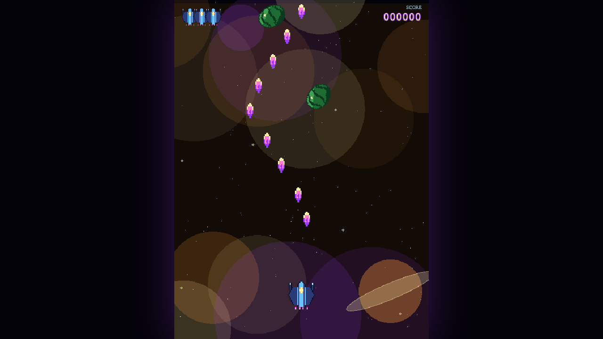
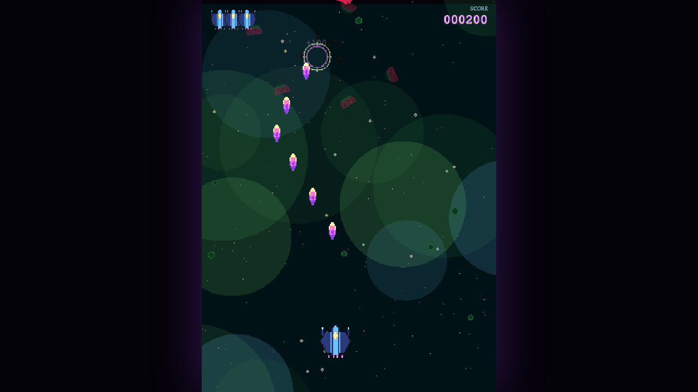

# 🍉 Spacemelon

> Pixel-art Galaga-meets-Geometry-Wars where you blast watermelons drifting through themed cosmic worlds.

<p align="center">
  
  
</p>

---

## What is it?

Spacemelon is a tiny arcade shooter built with **Phaser 3** and **TypeScript**.
Watermelons spin down through five themed worlds — _Iris Drift, Emerald Belt,
Crimson Reach, Gold Ring,_ and _Void Bloom_ — and your job is to shoot them
before they drift off the bottom of the screen.

- 🎨 **100% procedural art & audio.** Every sprite and sound is generated in
  code — no image or audio files anywhere in the repo.
- 🌌 **Five rotating worlds** with their own palettes and parallax backdrops.
- 🍈 **Megamelons** that take several hits and shatter into a spray of smaller
  melons.
- 🎯 **Deterministic runs.** A seeded RNG drives everything, so a given seed
  plays out identically on any machine.

### Scoring

| Action                   | Points   |
| ------------------------ | -------- |
| Pop a small melon        | **+100** |
| Hit a megamelon          | **+50**  |
| Destroy a megamelon      | **+500** |
| Let a small melon escape | **−50**  |
| Let a megamelon escape   | **−200** |

Your score floors at zero — even a rough run can't go negative.

## Controls

| Key                      | Action                                   |
| ------------------------ | ---------------------------------------- |
| `←` / `→` (or `A` / `D`) | Move                                     |
| `Space`                  | Fire                                     |
| `P`                      | Pause                                    |
| `M`                      | Mute / unmute                            |
| `Enter`                  | Start (menu) · Restart (after game over) |
| `Esc`                    | Back to menu (after game over)           |

## Run it locally

Requires [pnpm](https://pnpm.io) and Node (see `.nvmrc`).

```bash
pnpm install   # install dependencies
pnpm dev       # start the dev server at http://localhost:5173
```

Then open http://localhost:5173 and press **Space** to launch.

To build and preview a production bundle:

```bash
pnpm build     # type-check + production build to dist/
pnpm preview   # serve the build at http://localhost:4173
```

### Handy URL params

The game reads optional query params, which are great for jumping straight into
a scenario:

```
http://localhost:5173/?seed=42&level=4&autoplay=1&invincible=1&debug=1
```

| Param        | What it does                                 |
| ------------ | -------------------------------------------- |
| `seed`       | Seed the deterministic RNG (int or `0xHEX`). |
| `level`      | Start on a specific level / world.           |
| `autoplay`   | Skip the menu and start immediately.         |
| `invincible` | Ignore watermelon collisions.                |
| `debug`      | Show the FPS/entity HUD + physics debug.     |
| `paused`     | Boot paused (handy for screenshots).         |
| `muted`      | Start with sound off.                        |

## Tests

End-to-end tests run [Playwright](https://playwright.dev) against a real built
bundle:

```bash
pnpm test:install   # one-time: install the Playwright chromium browser
pnpm test           # build, serve, and run the suite
pnpm typecheck      # tsc --noEmit
```

## Project layout

A deeper tour of the architecture, the agent bridge (`window.__SPACEMELON`), and
contribution conventions lives in [`CLAUDE.md`](./CLAUDE.md).
